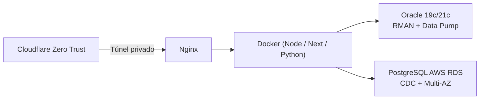

# Vinicius Lourenço
### Database Administrator & Cloud / DevOps Engineer

*Sustentação de bancos de dados de missão crítica, arquitetura multi-cloud e engenharia de software.*

---

## Resumo Profissional

- **Administração de Bancos de Dados:** sustentação e engenharia de bancos OLTP em produção (**Oracle 19c/21c** e **PostgreSQL na AWS RDS**), mantendo SLA de **99.98%** de disponibilidade.
- **Performance Tuning:** análise de planos de execução (`EXPLAIN ANALYZE`, **AWR**, **ADDM**, `pg_stat_statements`), ajuste de `autovacuum` e mitigação de locks concorrentes.
- **Backup e Disaster Recovery:** rotinas com **RMAN** e **Data Pump**.
- **Migrações Heterogêneas:** Oracle → PostgreSQL na AWS, com conversão de schemas, mapeamento de tipos e replicação contínua via CDC (**AWS DMS**).
- **Multi-Cloud e Infraestrutura:** **OCI**, **AWS**, **Vercel** e **Render**, com **Docker**, **Terraform** e acesso seguro via **Cloudflare Zero Trust**.
- **Desenvolvimento Full-Stack:** **Next.js**, **React (PWA)**, **Node.js** e **Fastify**.

---

## Stack

| Área | Tecnologias |
| :--- | :--- |
| **Bancos de Dados** | Oracle (19c, 21c, ATP Exadata), PostgreSQL (AWS RDS), MySQL 8.0, MongoDB, PL/SQL, Flyway |
| **Cloud e DevOps** | OCI, AWS (RDS, DMS, S3), Docker, Cloudflare Zero Trust, Terraform, Linux (Ubuntu / Oracle Linux), Nginx |
| **Linguagens e Frameworks** | Node.js, Next.js, React, TypeScript, Python, Fastify, Express, Prisma, Bash |
| **CI/CD e Observabilidade** | GitHub Actions, Render, Vercel, telemetria via webhooks e crons |

---

## Projetos em Destaque

### [CloudOps Hub](https://github.com/ViniScooper/CloudOps_Hub): console multi-cloud e DevOps
Plataforma para gerenciar servidores em nuvem, containers Docker, túneis Zero Trust e deploys, com assistente de IA integrado.

- **Stack:** Next.js (App Router), Node.js, Fastify, Docker, Cloudflare Zero Trust, OCI
- **Telemetria ao vivo:** CPU, RAM, armazenamento e status dos nós
- **Guardião anti-sleep:** crons internos que evitam hibernação de serviços PaaS (sem cold start)
- **Orquestração de deploys:** painéis integrados às APIs da Vercel e do Render
- **Odisseu AI Copilot:** assistente com RAG para análise de logs, status de containers e execução de scripts
- [Ver em produção](https://cloudops-hub-dun.vercel.app/)

### [FinControl](https://github.com/ViniScooper/controle-financeiro): gestão financeira e amortização
PWA mobile-first para quitação acelerada de contratos e controle de orçamento.

- **Stack:** React (Vite PWA), Node.js, Express, Oracle Autonomous Database (ATP), JWT
- **Simulador de amortização:** calcula a economia de juros ao aplicar rendas extras (13º, bônus)
- **PWA instalável** em iOS e Android, com Service Worker e suporte offline
- **Bot de WhatsApp (CallMeBot):** lembretes de faturas e registro de despesas por mensagem
- [Acessar o app](https://controle-financeiro-mauve-two.vercel.app/)

---

## Boas Práticas

- **Zero Exposure:** portas de banco e SSH nunca ficam abertas na internet; todo o tráfego passa por túneis criptografados.
- **Database as Code:** schemas (DDL/DML) versionados via migrations integradas ao CI/CD.
- **Resiliência:** backups automatizados, exportação lógica e monitoramento proativo de métricas.

---

## GitHub Stats

  
  

---

Vamos conversar sobre bancos de dados, infraestrutura ou projetos desafiadores? Me chame no LinkedIn ou por email.
